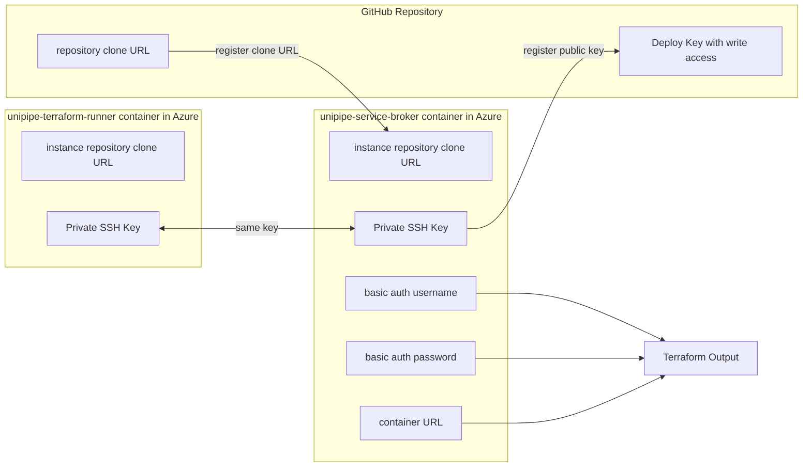

# Standard deployment with GitHub integration

This example spins up an UniPipe service broker with a GitHub repository as instance repository.



## How to use this example

Copy the files.

```sh
curl https://raw.githubusercontent.com/meshcloud/terraform-azure-unipipe/main/examples/standard-deployment-with-terraform-runner/main.tf > main.tf
curl https://raw.githubusercontent.com/meshcloud/terraform-azure-unipipe/main/examples/standard-deployment-with-terraform-runner/outputs.tf > outputs.tf
```

Replace all occurrences of "..." with proper values.

Run `terraform init` and then `terraform apply`.
