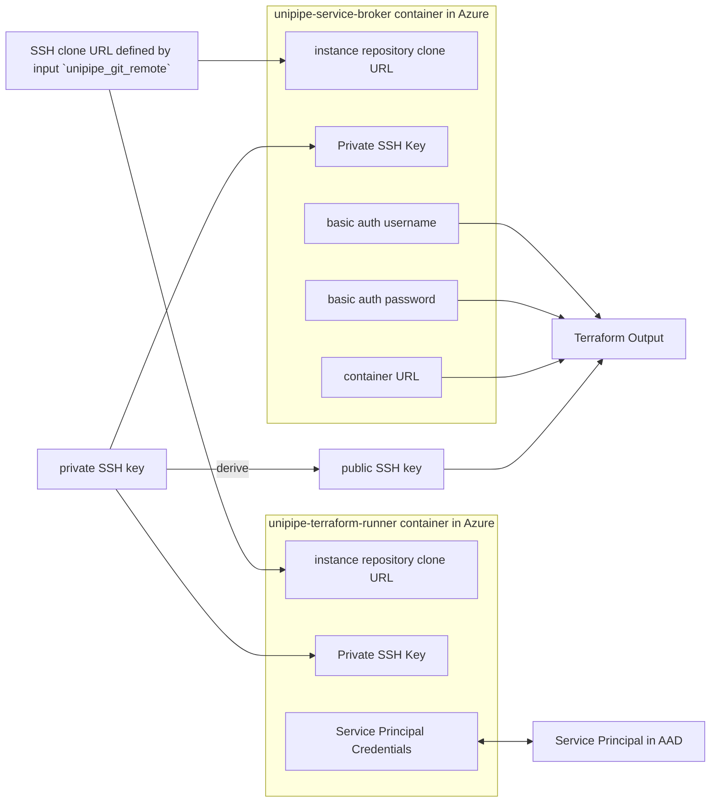

# Standard deployment with unipipe terraform runner

This example spins up UniPipe service broker and terraform runner.

It also creates a service principal and grants terraform runner access to this principal.



## How to use this example

Copy the files.

```sh
curl https://raw.githubusercontent.com/meshcloud/terraform-azure-unipipe/main/examples/standard-deployment-with-terraform-runner/main.tf > main.tf
curl https://raw.githubusercontent.com/meshcloud/terraform-azure-unipipe/main/examples/standard-deployment-with-terraform-runner/outputs.tf > outputs.tf
```

Replace all occurrences of "..." with proper values.

Run `terraform init` and then `terraform apply`.
